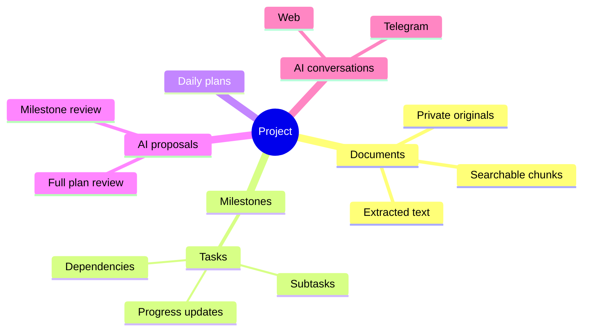
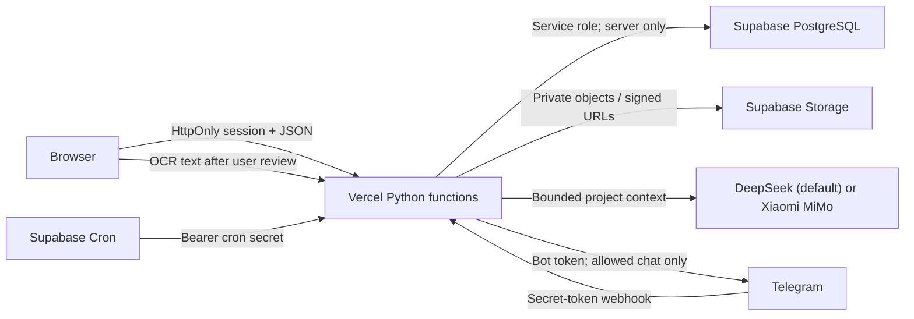
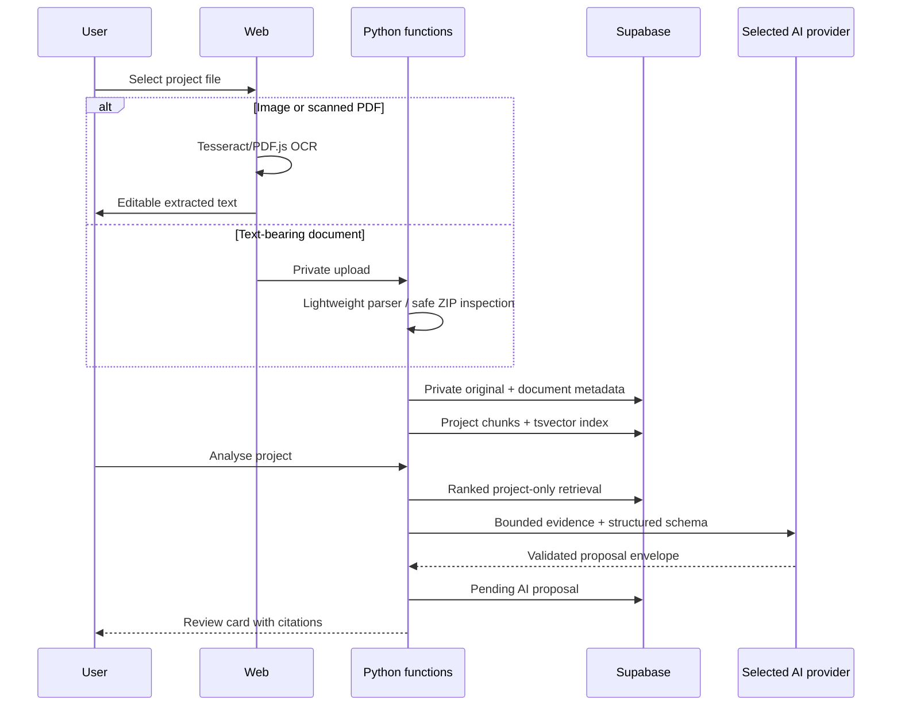

# Architecture

## Information hierarchy

## Components and trust boundaries

The browser never receives the Supabase server key, DeepSeek/MiMo keys, bot token, webhook secret, cron secret, or login hash. Exposed tables enable RLS and deny `anon`/`authenticated`; Python functions use the server key after their own session/cron/webhook checks.

## Request flows

### Document and analysis

### Proposal approval

Free-form AI output never mutates data. Pydantic validates model intent, dates, percentages, UUIDs, statuses, priorities, project ID, and proposal shape. `approve_ai_proposal` applies the full plan atomically. `approve_proposal_milestone` persists review state and one milestone at a time. Rescheduling stays pending until an explicit approval call.

### Progress and risk

Calculated progress is `sum(task progress × effort weight) / sum(effort weight)`, excluding cancelled work. Displayed progress uses a manual override when present. Expected progress interpolates each scheduled task between planned start and due date, weighted by effort. Risk precedence is completed → critical blocker → past deadline → overdue/≤−20 variance → ≤−10 variance/capacity overload → on track.

### Telegram

Telegram validates `X-Telegram-Bot-Api-Secret-Token`, then compares the chat ID to the single allowed ID without revealing match details. A unique `update_id` insert prevents duplicate application. Commands and natural messages use the same project data and conversation tables as the web. Important date changes return inline approval controls.
